### Alejandro Da Silva, Longchao Jia, Vinod Kumar, Max May, Harrison Wilco
# Background

Each year (considering 2020 an outlier...) 64 teams meet in the NCAA Division I Men's Basketball Tournament. This 
tournament, also known as NCAA March Madness, is one the most popular sporting events in the US. Predictions of 
tournament games are of interest to the sports-betting community as well as college sports fans — approximately 70 
million brackets are filled out annually attempting to predict the outcome of the NCAA tournament [1].

## Tournament Structure

32 Division I conference champions receive automatic bids to the tournament, while 36 teams are selected at-large from 
the remaining schools. These at-large teams are chosen by an NCAA tournament selection committee. Teams are divided into 
four regions before being seeded (ranked, lower seeding should indicate higher skill) 1-16. The 68 teams given bids 
to the tournament are narrowed down to 64 teams after the first four play-in games, and then the field of 64 teams begin
a single-elimination tournament. This 64 team (63 game) tournament is what our project focused on.

# Methods

This project aimed to utilize various machine learning techniques to analyze the NCAA tournament. Unless otherwise 
noted, the algorithm implementations used were from the Python package scikit-learn [2]. Unsupervised clustering was 
employed in an attempt to group teams based on skill level (and thus replicate seeding) based on regular season 
statistics from the teams. Additionally, clustering was employed to distinguish teams which qualified for the tournament
from teams which did not. Supervised learning techniques [3] aimed to predict the winners of individual matchups in 
tournament play. In the past, machine learning models have proven somewhat successful in this application, yielding 
better results than predictions by sports experts [4].

The clustering approach to seeding/tournament qualification has not shown up in our prior work searches.

## Data

The dataset used in this project was scraped from Sports Reference [5]. Data from the 2010 through 2018 seasons were 
used. Regular season statistics such as team field goal percentage, win-loss percentage, and strength of schedule were 
used. Additionally, win-loss percentage times strength of schedule was used as a derived statistic, as we would expect
wins against a tougher schedule to be more important than wins against easy opponents. This resulted in a final set of 
15 features. Finally, each statistic was normalized relative to the teams which made the tournament for a given year. 
For example, each team which had the worst field goal percentage of the year while making the tournament was given a 0 
for FG% Norm, while the team which made the tournament with the best FG% was given a 1 for FG% Norm. This step was taken
to try to equalize the statistics over time, as averages for different statistics can vary by large amounts over a 
nine-year period as the game of Division I basketball changes. The use of statistics normalized by year was a new 
approach meant to make it easier to generalize results generated from previous years to future years.

This stats dataset was used in tandem with Sports Reference's history of past NCAA tournament games and results to 
create a combined dataset, where each instance represented one tournament matchup. For a matchup, the one of the teams
was randomly selected as Team1, while the other was Team2. The resulting features were created from the relative 
difference of each statistic, that is \[(Team1 val - Team2 val)/avg(Team1 val, Team2 val)] for for each stat from the 
stats dataset. The label for each instance was whether Team1 won the game.

### Full list of features:

1. Win-loss percentage.
2. Strength of schedule (SOS).
3. Offensive Rating (ORtg).
4. Defensive Rating (DRtg).
5. Field goal percentage.
6. Seed (0 for non-qualified teams).
7. Win-loss percentage times SOS.
8. Three point percentage.
9. Free throw percentage.
10. Points per game (PPG).
11. Opponents points per game (OPPG).
12. Assists per game (APG).
13. Turnovers per game (TOVPG).
14. Adjusted margin.
15. Adjusted win-loss percentage.

## Evaluation

The unsupervised clustering methods were evaluated based on a number of metrics, including purity, mutual information 
score, and contingency matrices.

The supervised methods were evaluated on accuracy, Matthew's correlation coefficient, and ROC AUC. Additionally, 
confusion matrices are presented.

# Principal Component Analysis

PCA was applied before using certain methods that are best used with fewer features. Additionally, PCA was used prior to
applying methods that require linearly independent features (as the base features were dependent in some cases).

We observed that out of the 15 features in the matchup data set, **70.2%** of the variance could be captured by the first three 
principal components. Furthermore, **95%** of the variance could only be captured by using at least nine components, 
with **99%** of variance recovered requiring 11 components.

# Unsupervised Learning

For the unsupervised learning, the seed feature was removed from the stats dataset (for obvious reasons). After PCA on 
the stats dataset with the seed feature removed (for obvious reasons), we needed nine components to recover at least 
**95%** of the variance.

It is important to note that the dataset used in unsupervised learning is not the same as the one used for supervised 
learning — the stats dataset used here was not combined with the NCAA tournament games dataset, thus each instance 
represents a Division I NCAA basketball team and their regular season statistics.

## k-means

As we mentioned before, the NCAA tournament divides the 64 qualified teams into 16 different seed, according to their 
performance during the regular season. In reality, the selection of tournament teams as well as seeding has a high 
degree of subjectivity. Our goals are to quantify that subjectivity using the k-means clustering algorithm.

We decided to start with the data from year 2018. Initially, we sought to separate the teams into two separate clusters:
one for qualified teams and the other for unqualified ones using the k-means algorithm. We used all 14 principal 
components (after excluding seeding) when computing the Euclidean distance in the algorithm.

Encouraged by the clear separation between the clusters, we decided to divide the qualified teams for the year 2018 by 
clustering the teams into 16 clusters (equivalent to 16 seeds) based on the all of the transformed statistics obtained 
with PCA. We obtained the following results

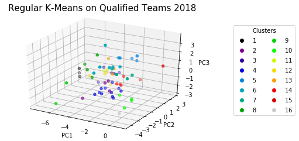

    
It seems like clustering was not very good. Specifically, the purity of the clustering hovers at **39.5%**. We 
hypothesized that decreasing the number of clusters to 4 (which corresponds into 1-4 seeds, 5-8 seeds, etc.) would yield
better results

    
Here, purity was **56.1%**. Even though we achieved better results, we noticed another problem with the regular k-means 
algorithm, specifically that number of points per cluster is not limited. For example, the number of datapoints in the 
last run were as follows:

| Cluster Number       | Number of Elements   |
|:-----------------------------:|:----:|
| 1                            | 10   |
| 2                            | 15   |
| 3                            | 17   |
| 4                            | 22   |

We would expect to see an equal number of teams assigned to each seed (or group of seeds) if following real seeding 
procedures.

### Modified k-means

Given these limitations, we created a modified k-means algorithm that evenly divides data points across clusters. 
Specifically, the clusters prioritize having the minimum distance between a datapoint and the cluster center, discarding
the points that are farther away. These points in turn are forced to belong to another cluster. The implementation 
looked as follows for both the cases of 16 and 4 clusters.

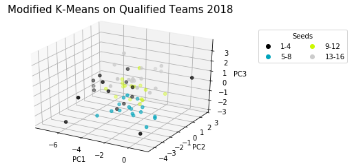
    
When we looked at the purity of each clustering, we obtained slightly better results when compared to the regular 
k-means algorithm. Specifically, we obtained a purity of **41.7%** for 16 seeds (compared to 39.5%) and **57.5%** 
(compared to **56.1%**).

We then decided to further test the performance of both clustering algorithms by using data for all available years in 
the dataset (2010-2018). We used the normalized statistics to minimize differences in performance across the years. 
Results of PCA are shown here for contrast against the clusters later on.

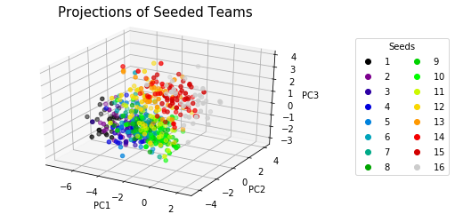
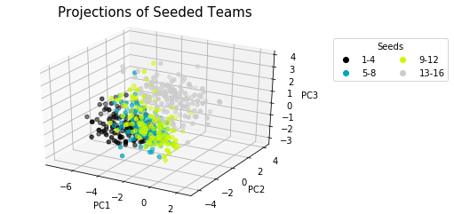
    
Furthermore, these are the results of running both algorithms for 16 clusters... 

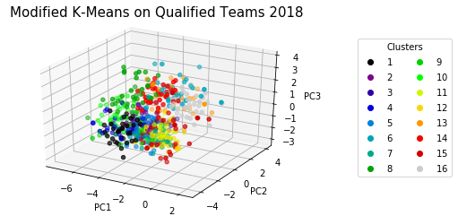
    
...and 4 clusters ...

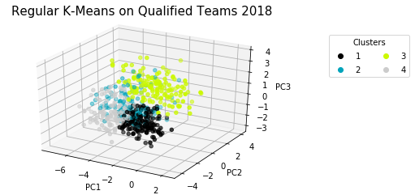
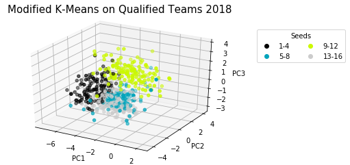
    
In terms of purity, we obtained the following measurements.

| Number of Clusters       | Regular   | Modified  |
|:-----------------------------:|:----:|:---:|
| **16**                            | 26.5% | 26.1% |
| **4**                            | 54.9%   |   55.0% |

It is important to recognize the limitations of the latter approach to unsupervised clustering. Given more data, it 
appears that both algorithms have the same performance. This spans from the prioritization of assignment of data points 
to a cluster. A careful observer would note that some points in the modified k-means algorithm are far away from their 
cluster center. This points could be called "outliers", not being close enough to any cluster center and thus assigned 
by default to a the center that is closest to it that doesn't have all points assigned to it yet. This method showed 
some promise, but could use refinement.

## Hierarchical Clustering (Seeding)

Hierarchical clustering is used to build groupings with variable cluster sizes depending on where the tree is cut. As 
the distinction between 16 seeds might be too hard, an even number of seeds can be conflated to one and the clustering 
validation can be compared for different seed sizes. PCA was applied, keeping nine components.

For hierarchical clustering two important settings need to be considered. One is the metric, for which Euclidean 
distance is commonly used. The other one is the linkage, which can be single link, complete link, average link, etc. 
Here, average link was chosen because it is often recommended for general tasks, avoids chaining, and clusters mostly 
into evenly sized groups, which is necessary for our task. The effect of this can be seen in the following dendrogram.

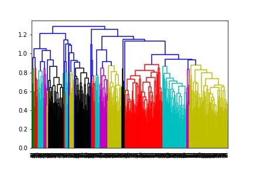

After clustering is performed, we evaluate how good it is by means of different validation metrics.

The purity gives us an indicator of how purely the clusters consist of only data points from a single ground truth, with
1 corresponding to the best purity. For the given task we get the best purity when we only partition into two seeds and 
the purity decreases with the number of seeds, as expected.

The mutual information measures the amount of information shared between clustering and ground truth. The adjusted 
variant of MI is independent of the number of clusters in a partition, otherwise a higher number of clusters would give 
a better MI score. Larger values indicate a good clustering. Our results show a slight decrease in the AMI for an 
increased number of seeds.

The random score is a pairwise measure, which is the fraction of true positives and true negatives over the total number
of pairs. The adjusted rand score is centered and normalized to adjust for chance. Negative values are bad, close to 
zero means random and a score of one means that the clustering assignments are identical up to label permutations. For 
our task the ARI slightly decreases with the number of seeds.

An overall trend of decreased performance can be observed as the partitioning of the teams into the seeds gets finer. 
With a purity below **20%** for partitioning into the regular 16 seeds, this means that this task is harder than 
expected based on the provided features.

## Hierarchical Clustering (Tournament Qualification)

Another clustering task is to determine which teams qualified for the tournament.
The 3D visualization via PCA applied on the full data set (not just qualified teams) shows that the clusters of qualified
vs. non-qualified teams appears easier to distinguish.

This is also visible in the decrease in variance of the principal components (when including all teams, not only 
qualified teams in PCA). Over **50%** of the variance is contained in the first component, whereas the other components 
only have minor contributions.

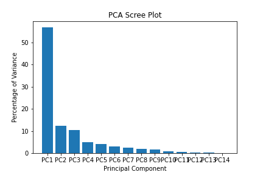

We need  9 features to recover **96.2%** of the variance.
A purity of **82%** for the qualified vs. non-qualified clustering is reached, as both clusters contain mainly points 
from one ground truth (qualified or non-qualified). But from the contingency matrix 

| Clustering/Qualification       | NQ   | Q  |
|:-----------------------------:|:----:|:---:|
| **C1**                            | 2521 | 576 |
| **C2**                            | 28   |   0 |

we can see that both clusters are assigned to the same ground truth partition. This results in a bad ARI and an AMI 
score close to 0. These results suggest that the qualified and non-qualified teams are not properly separable through 
hierarchical clustering and the distance metric utilized. The heavy bias toward non-qualified teams (as only 64 teams 
make the tournament each year) may be a contributing factor of this result.

## Unsupervised Learning Conclusion

The results from both k-means and hierarchical clustering seem to highlight the poor performance of unsupervised 
learning to predict the seeding positions for any given year. More complicated algorithms or more exhaustive data could 
yield to better results, but we expect those to only show marginal improvements over the algorithms described here given
the subjectivity of seeding assignment carried out by a group of judges. This performance could indicate one of two 
different results (or a mix of the two):

1. Clustering using the selected features is a poor way to group teams based on regular season performance.
2. The selection committee does not accurately seed teams based on objective metrics of regular season performance.

It is also worth noting that since 32 teams automatically qualify to the tournament based on conference championships, 
some weaker teams that happen to play in weaker conferences may qualify over stronger teams. Finally, seeding must take
into account considerations other than just strength [6]. For example, repeats of regular season matchups are avoided to
some extent in early rounds.

# Supervised Results

The following results were obtained using an 80-20 train-test split. 10-fold cross validation was performed to 
determine hyperparameters for each model using ROC AUC as the metric. The cross validations plots show performance vs
hyperparameter values. The blue line shows CV performance, with the shaded region showing an 80% confidence interval for 
the mean performance. The orange line shows performance over the entire training set. 

## k-NN

A standard scaler followed by PCA (with retained variance >= 0.99) were applied. 11 components are kept after the PCA 
step.

The results indicate that validation ROC AUC flattens off around k=19. k=19 produced a mean CV ROC AUC of **0.784**. The
plot shows clear overfitting at small values of k, as training performance is significantly higher than CV performance.

## SVM

Support vector machines use a hyperplane to separate classes, potentially using a kernel trick before separation to
allow for non-linear classification. We landed on a radial basis function (rbf) kernel. Two important hyperparameters 
for support vector machines are C (regularization parameter) and gamma (kernel coefficient).

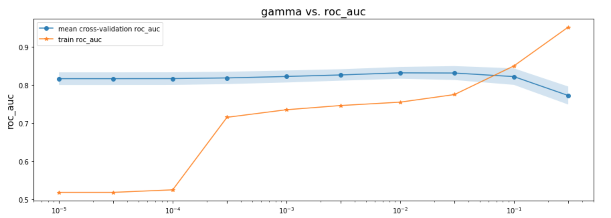

The best fit hyperparameters we have for SVM are C=100 and gamma=1e-3, yielding a mean CV ROC AUC of **0.781**.

## Logistic Regression

A logistic regression uses a logistic function to model a binary dependent variable, resulting in a linear classifier. 
The hyperparameters to be tuned are C (inverse of the regularization strength) and tol (tolerance for stopping 
criteria). 

We found C=1 and tol=5e-4 gave the best results, yielding a mean VS ROC AUC of **0.832**. While this CV results is good, one concerning aspect of the plots is the consistent underfitting evidenced. Training performance seems to be far lower than CV performance across all hyperparameter values tested.

## Decision Tree

Decision trees repeatedly split data based on thresholds for a certain features to classify data points at leaf nodes.
Decision trees trained on data before scaling and PCA performed significantly better than after PCA, thus PCA was not
applied for these models. The main hyperparameter of interest is the tree's maximum depth.

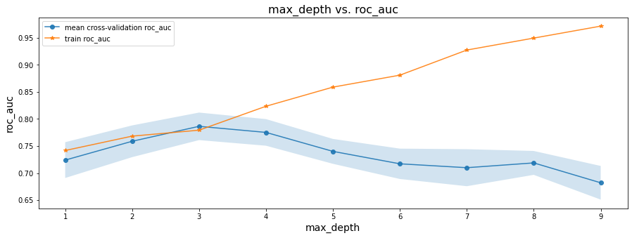

After cross-validation, a max-depth of three was selected, yielding a mean CV ROC AUC of **0.786**. It is clear that as 
the depth of the tree increases, the model tends to overfit, as training performance steadily rises while CV performance
falls off after a max depth of three. Here is a tree of depth three trained on the entire training set:

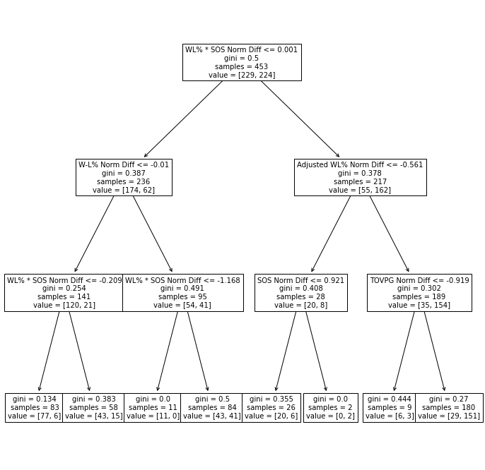

## Random Forest

A random forest classifier is an ensemble classifier that fits many simple decision trees to the data then has them each
vote for a class label. The implementation chosen uses bagging (bootstrap aggregating). Again, PCA seemed to hurt model 
performance and thus was not used.

Here it appears CV performance levels off after approximately 60 estimators, with a mean CV ROC AUC of **0.799**. This
model, however, appears to have extreme overfitting issues. Training ROC AUC (and accuracy) quickly hits **1.000**. To 
combat this issue we decided to decrease the complexity of the base estimators by limiting the max depth of the decision
trees used to four.

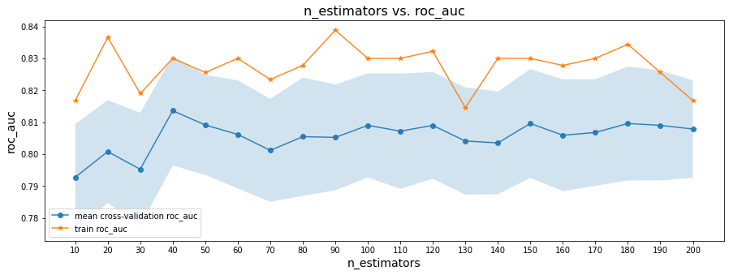

Now we find 40 estimators provides the best performance, with a mean CV ROC AUC of **0.814**. While this increase is
likely not statistically significant with any reasonable degree of certainty, we did achieve the desired result — 
training performance is far closer to CV performance.

## MLP

A multilayer perceptron is a feedforward artificial neural network (ANN) composed of multiple layers of perceptrons with
threshold activations. MLPs are relatively complex in terms of hyperparameters to tune.

In the scikit-learn implementation, we tuned the number of hidden layers, the number of neurons in each layer, alpha (L2
penalty parameter), initial learning rate, hidden layer activation function, and max number of iterations. With so many 
hyperparameters, a grid search based approach similar to the approaches used previously would either cover too little of
the hyperparameter space, or take too long. Instead, a random search over the hyperparameter space was used. We limited 
the MLP to at most two hidden layers (no performance increases seen after two layers), limited neurons per layer to the
range [5, 200], limited alpha to the range [1e-5, 1e-1] (with a log-uniform distribution), limited initial learning rate
to the range [1e-4, 1e-2] (with a log-uniform distribution), and limited the max number of iterations to the range 
[25, 500]. Then 10000 hyperparameter configurations were run through 5-fold cross validation. The best model 
configurations from each set of 2000-3000 configurations consistently reached mean CV ROC AUC scores of approximately 
**0.86**. The chosen configuration had the highest score by a small margin, with a mean CV ROC AUC of **0.862**.

| Hyperparameter | Value |
|:--------------:|:-----:|
| num hidden layers | 2 |
| hidden layer sizes | (86, 24) |
| initial learning rate | 3e-4 |
| max iterations | 244 |
| activation | tanh | 

We also examined the learning rate of the selected model.

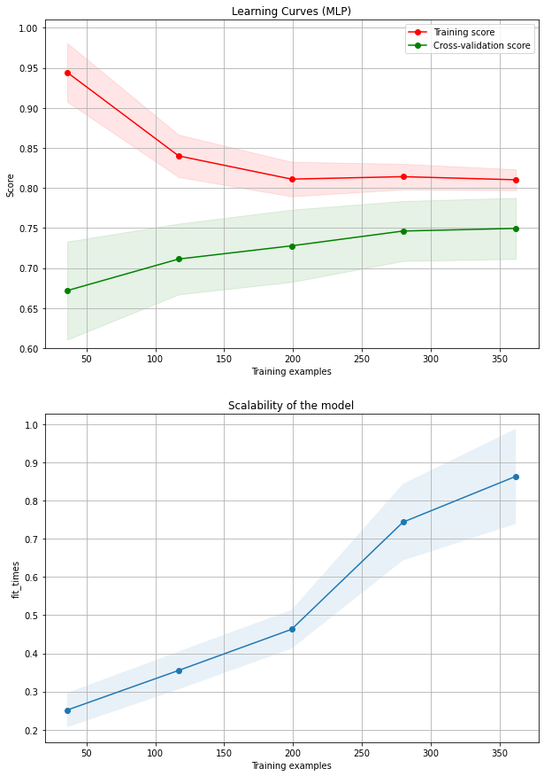

## Supervised Learning Conclusion

### Model Comparison

| Model | Mean CV ROC AUC |
|:-----:|:---------------:|
| k-NN                | 0.784 |
| SVM                 | 0.781 |
| Logistic Regression | 0.832 |
| Decision Tree       | 0.786 |
| Random Forest       | 0.814 |
| MLP                 | 0.862 |

As indicated above, the MLP model performed at the highest rate, then the logistic regression, followed by the random forest. The remaining models each had similar, even lower performances (though these ROC AUC values were still rather high).

### Testing Performance

Since the MLP had the highest mean CV ROC AUC, it was selected as the model to train on the entire training set and use 
for testing. It achieved the following results on the testing set:

| Metric | Score |
|:------:|:-----:|
| ROC AUC  | 0.888 |
| Accuracy | 0.886 |
| MCC      | 0.775 |
| F1 Score | 0.885 |

Using the Wilson score interval [7], we can say with **95%** certainty that our model's mean accuracy is 
**0.886 &#177; 0.059**.

The confusion matrix produced was:

| Team1 Prediction/Team1 Result | True Win | True Loss |
|:-----------------------------:|:--------:|:---------:|
| Predicted Win  | 51 | 9  |
| Predicted Loss | 4  | 50 |

### Performance Evaluation

The official NCAA Bracket Challenge game receives millions of entries each year [8]. Unfortunately, the uncertain nature of 
matchups makes it hard to compare our model to overall accuracy in bracket challenge games. After the first round, the 
teams people predict to win games may not even get a chance to play in those games (if they were eliminated). As such,
we can only compare accuracy with first round accuracy, however this should be a reasonable comparison. From 2015-2017, 
first round games were predicted correctly **72.1%** of the time [9], a mark well below the testing accuracy of our model. 
Additionally, of all first round matchups (1 vs. 16, 2 vs. 15, etc.) participants only predicted matchups of 1 vs. 16 
teams at a higher rate than our model predicted all matchups (**97.9%** of 1 vs. 16 matchups were predicted correctly) 
[9]. 2 vs. 15 matchups were predicted at the same rate as our model's test, and matchups closer than 2 vs. 16 fell 
sharply in accuracy [9].

Perfect predictions of NCAA tournament games will likely never be possible. Too many confounding variables are involved, 
from player injuries to motivation. Our team is very happy with the performance achieved by our final model, however. 
The model scored quite well in each metric when run on the withheld test set.

# Future Work

## Data

The most obvious place to improve is the acquisition of more data points. While some of the advanced statistics used as 
features were not tracked until 2010, expanding the dataset to include all NCAA tournament games but reducing features 
down to basic features may still improve performance. Otherwise, as more NCAA tournament occur, more data will become 
available for training.

First, a larger number of statistics could be pulled from Sports Reference as well as other sources. Metrics such as SRS
(simple rating system), pace, RPI (rating percentage index), and true shooting percentage could all provide more 
informative power to models. Additionally, the NCAA has recently implemented a new metric called the NET (NCAA 
evaluation tool) which they claim serves as a comprehensive measure of team strength [10]. The NET ranking could not be
used as NET rankings only date back to the 2019 season.

A different approach entirely would be to use more in-depth, play-by-play statistics rather than aggregate season 
statistics. While data collection and processing would be more difficult, model performance may see benefits. This 
approach may also allow the model to account for injuries or otherwise inactive players.

## Supervised Learning

Utilizing random searches for all models tried may have marginally increase some of their performances by testing out a
larger/more comprehensive hyperparameter space. In general, random search has several advantages over grid search:

1. Adding hyperparameters which are uninformative does not decrease search efficiency [11].
2. A budget can be chosen independent of the number of hyperparameters and possible values [11].
3. Random search provides higher effective dimensionality, resulting in more efficient searches [12].

# References
[1] American Gaming Association (2019, Mach 18). *2019 March Madness Betting Estimates*.

[2] scikit-learn. *scikit-learn: About us*. (n.d.). Retrieved from https://scikit-learn.org/stable/about.html.

[2] Kvam, P., and J. S. Sokol. (2006, July 14) *A logistic regression/Markov chain model for NCAA basketball*. Naval 
Research Logistics 53(8):788–803.

[4] Bunker, R. P., and F. Thabtah. (2017, September 19) *A machine learning framework for sport result prediction*. 
Applied Computing and Informatics 15(1):27–33.

[5] Sports Reference. *College Basketball Statistics and History: College Basketball at Sports.* (n.d.). Retrieved from 
https://www.sports-reference.com/cbb/.

[6] NCAA.com. (2019, October 31). *How the field of 68 teams is picked for March Madness.* Retrieved from 
https://www.ncaa.com/news/basketball-men/article/2018-10-19/how-field-68-teams-picked-march-madness

[7] Wilson, E. B. (1927). *Probable Inference, the Law of Succession, and Statistical Inference.* Journal of the 
American Statistical Association, 22(158), 209–212. doi: 10.1080/01621459.1927.10502953

[8] Wilco, D. (2020, March 26). *The absurd odds of a perfect NCAA bracket.* Retrieved from 
https://www.ncaa.com/news/basketball-men/bracketiq/2020-01-15/perfect-ncaa-bracket-absurd-odds-march-madness-dream

[9] Wilco, D. (2020, April 21). Personal interview.

[10] NCAA.com. (2019, December 16). *The NET, explained: NCAA adopts new college basketball ranking.* Retrieved from 
https://www.ncaa.com/news/basketball-men/article/2018-11-26/net-explained-ncaa-adopts-new-college-basketball-ranking

[11] NCAA.com. *Tuning the hyper-parameters of an estimator.* (n.d.). Retrieved from 
https://scikit-learn.org/stable/modules/grid_search.html#randomized-parameter-search

[12] Bergstra, J., & Bengio, Y. (2012). *Random Search for Hyper-Parameter Optimization.* Journal of Machine Learning 
Research, 13, 281–305. Retrieved from http://www.jmlr.org/papers/volume13/bergstra12a/bergstra12a.pdf
